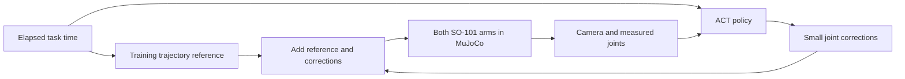

# Learned grasping: results and how to watch

The selected controller is a **hybrid: a trajectory reference learned from six
training demonstrations, plus small ACT corrections**. It is different from the
original ACT policy that predicted all joint targets directly. The direct policy
has not achieved a reliable full relay.

## What changed

We first trained the original policy for 3,000 steps, then emphasized grasping
frames, and then added corrective demonstrations. Prediction error decreased,
but full task success did not follow. One intermediate checkpoint learned to
grasp and lift, then touched the table during placement. Balanced training and
an elapsed-time input were also tested.

An averaged training trajectory completed all four development trials. The hybrid
keeps that reference and asks ACT to learn the smaller remaining corrections.
The reference is computed from **training episodes only**; validation and final
evaluation episodes do not contribute to it. Camera images, current joint angles
and elapsed task time feed ACT. Simulator object coordinates and expert stage
labels are not policy inputs. The scripted expert supplies no runtime actions.



## Evaluation

The selected checkpoint is `outputs/act_residual/checkpoints/step_000250`.
It passed **4/4 development trials** (1000, 0, 1, 2), then was frozen before the
final seeds 20000–20009 were used. Its assets and reserved seed list are recorded
in `artifacts/grasp_release_candidate.json`.

Final reports are `artifacts/act_residual_final/summary.json` and
`artifacts/mean_trajectory_final/summary.json`. Each trial saves its joint targets,
measured joint states, object trajectory, last image and physical milestone results.

| Frozen final comparison, seeds 20000–20009 | Complete relays | Monitored collision stops |
| --- | --- | --- |
| Training reference + ACT residual, checkpoint 250 | **10/10** | **0** |
| Training reference alone, without camera feedback | **10/10** | **0** |

Both completed all four ordered milestones. **There is no measured task-success
advantage from ACT on this test set.** The hybrid is a working implementation and
demo baseline; the original standalone learned-grasp objective remains unresolved.

The unchanged success test requires, in order: A grasps and lifts, A releases the
object at the transfer location, B grasps and lifts, and B releases at the final
location. Both-jaw contact must persist during lifts. Placement needs table support
and position within 15 mm of its marker. Inter-arm and arm-table contact stops the
run. Merely leaving the block at its initial position cannot pass.

## Watch the selected controller

From the project folder in PowerShell:

```powershell
.\scripts\watch_learned_relay.ps1
```

If local PowerShell policy prevents running scripts, run Python directly instead:

```powershell
.\.venv-train\Scripts\python.exe scripts\evaluate_act.py --checkpoint outputs/act_residual/checkpoints/step_000250 --view --seeds 0 --output artifacts/hybrid_view_manual_01
```

Use a new output directory for another direct invocation. The PowerShell launcher
chooses a unique output name automatically. Keep the entire checkpoint folder:
the model, processors and `trajectory_prior.npy` are required together. The
controller manifest checks the reference file's hash.

## Scope of the result

- This is a **table-supported relay**, not an airborne hand-off or a complete
  dinner-table task with different objects.
- Tests vary initial block XY by ±3 mm, mass from 30–50 g and sliding friction
  from 0.8–1.2. Camera, lighting, object shape and initial arm poses remain fixed.
- The reference-only baseline is strong on this narrow distribution. Matching it
  does not demonstrate a task-success benefit from learned visual corrections.
- The clock assumes the task keeps pace with its reference. Recovery from a failed
  grasp or a moved object has not been established.
- Targets run at 50 Hz of simulation time, with a new 50-action prediction every
  10 targets. These are NVIDIA/PyTorch runs, not OpenVINO/Core Ultra benchmarks.

The experiment history is in [GRASP_EXPERIMENTS.md](GRASP_EXPERIMENTS.md).
